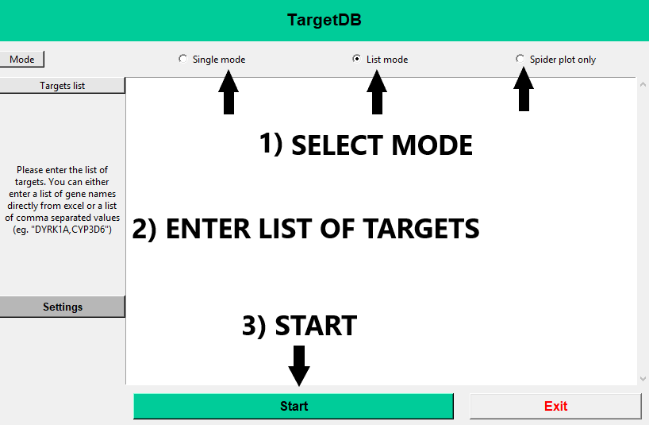
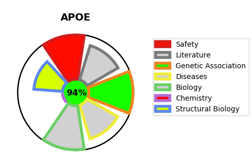
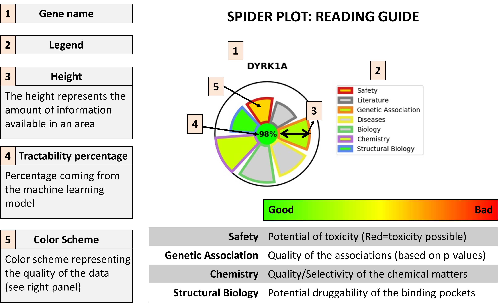
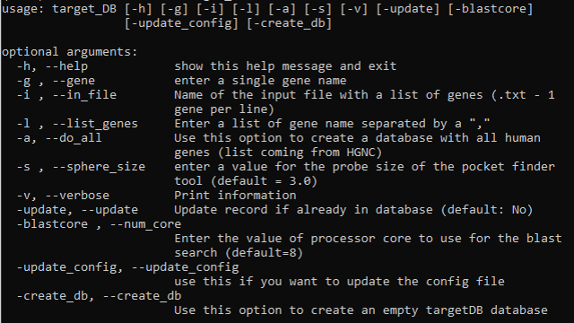

TargetDB
=========

TargetDB is a tool to quickly query multiple publicly available databases and provide an integrated view of the information available about potential targets. A quick binding pocket search is also performed (using `fpocket`).

**Tutorial**: A document containing details on the methods used can be found [HERE (pdf)](targetDB/resources/TargetDB_tutorial.pdf)

Installation
------------
### Python package installation
#### Pip installation

```
pip install targetDB
```

#### Conda installation

```
conda create --name targetdb --channel bioconda targetdb
conda activate targetdb
target_DB --help
```

##### Python compatibility

python version **>= 3.4**

Preferred python distribution : [Anaconda 3](https://www.anaconda.com/download/)


#### Database files installation

This package relies on the use of sqlite database to properly function.

##### Required database

+ targetDB

You can download a copy of the database [HERE](https://github.com/sdecesco/targetDB/releases/download/v1.3.1/TargetDB_20_12_19.db.zip)

>This database contains all of the human genome genes that have a uniprot ID

#### System compatibility

+ Linux
+ Windows
+ Mac (not tested)


Usage
-----
targetDB package provides a user interface to use the tool: `targetDB`

### `targetDB`

When using `targetDB` for the first time you will be asked to enter information about:
+ targetDB sqlite database file
+ path to save list output files
+ path to save detailed target output files
+ email address (used for pubmed searches if none provided no pubmed search will be run)

Those informations will be stored in ~/.targetdb/config.ini


Once created it will automatically start the main user interface (as seen below)




Examples
-----
TargetDB can be used in three modes:
+ Single
+ List 
+ Spider plot 

####Single mode outputs
A series of examples can be downloaded here (Excel file)
+ [ACHE](targetDB/examples/single_targets/ACHE_P22303.xlsx)
+ [APOE](targetDB/examples/single_targets/APOE_P02649.xlsx)
+ [BACE1](targetDB/examples/single_targets/BACE1_P56817.xlsx)
+ [Tau](targetDB/examples/single_targets/MAPT_P10636.xlsx)
+ [PSEN1](targetDB/examples/single_targets/PSEN1_P49768.xlsx)

####List mode outputs
In this example we have used a list of 95 targets provided by the AMP-AD consortium ([LINK HERE](https://agora.ampadportal.org/genes/))

You can download two version of the list with different weight used to construct the MPO Score
+ [AMPAD - Medicinal chemist pioritization](targetDB/examples/List_outputs/AMPAD_NomList_MedChemMPO.xlsx)
+ [AMPAD - Structural biologist pioritization](targetDB/examples/List_outputs/AMPAD_NomList_StructuralMPO.xlsx)

You can also find a list used to prioritize an entire class of proteins (Solute Carrier Protein)
+ [SLC Prioritization](targetDB/examples/List_outputs/SLC_ListPrioritization.xlsx)

A definition of all the columns in the output can also be downloaded
+ [Columns definition](targetDB/examples/List_outputs/TargetDB_list_output_columns_definition.xlsx)

####Spider Plots
A spider plot is here used to quickly give an idea of the area in which a target has strength and weaknesses

Here under a guide to help reading these plots: 


Instructions to create a targetDB database from scratch
---
>**`WARNING`**: This mode is not fully supported and we cannot guarantee it will execute without errors

#### System compatibility
+ Linux

##### Database creation

`target_DB`



The list of required databases is :
+ ChEMBL v25

ChEMBL sqlite database can be directly downloaded [HERE](https://www.ebi.ac.uk/chembl/downloads)

>This mode will generate a targetDB database that can then be used in report mode

#### Other dependencies for the database creation mode

##### blast
This mode use blast locally to perform similarity search and sequence alignments

information to download and install blast locally can be found [HERE](https://blast.ncbi.nlm.nih.gov/Blast.cgi?CMD=Web&PAGE_TYPE=BlastDocs&DOC_TYPE=Download)

##### fpocket
In order to perform binding pocket searches and assess their druggability the program fpocket is used

>Vincent Le Guilloux, Peter Schmidtke and Pierre Tuffery, "Fpocket: An open source platform for ligand pocket detection", BMC Bioinformatics, 2009, 10:168

>Peter Schmidtke, Xavier Barril "Understanding and Predicting Druggability. A High-Throughput Method for Detection of Drug Binding Sites", J. Med. Chem., 2010, 53 (15), pp 5858–5867

instructions to download and install fpocket can be found [HERE](https://github.com/Discngine/fpocket)

Current version of targetDB works with fpocket3

**targetDB will not be able to perform pocket search on windows as fpocket is not available on windows platform**
